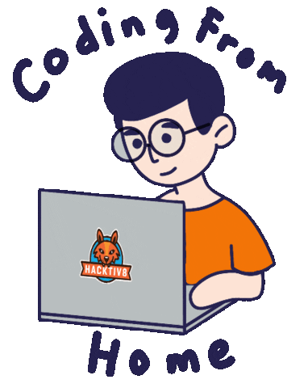

<h1>
  hey there
  
</h1>
  

  
  
  

Kubernetes evangelist. DevOps-practices preacher. Go adept.

## ✏️ Latest Blog Posts
<!-- BLOG-POST-LIST:START -->
- [Introducing GoDiffYAML Tool: Simplifying Diffing for Multi-Document YAML Files 💪](https://blog.rgeraskin.dev/godiffyaml)
- [AI with Kubernetes: Operations for Developers. Make k8s Beginner-Friendly with Natural Language 🤖](https://blog.rgeraskin.dev/ai-with-kubernetes)
- [Automating Development Environment with Mise: Comprehensive Guide 💫](https://rgeraskin.hashnode.dev/dev-env-with-mise)
- [Mastering Terraform Debugging: Tips and Techniques 🔧](https://rgeraskin.hashnode.dev/terraform-expressions-debugging)
- [Terramate meets Atlantis 🚀](https://rgeraskin.hashnode.dev/terramate-atlantis)
- [Terramate ❤️ Zsh](https://rgeraskin.hashnode.dev/terramate-zsh)
<!-- BLOG-POST-LIST:END -->

Check out other posts at https://blog.rgeraskin.dev

### 🔔 Be notified about new posts with
- [ hashnode](https://rgeraskin.hashnode.dev)
- [ dev.to](https://dev.to/rgeraskin)
- <a href="https://rgeraskin.medium.com"> medium</a>
-  [RSS](https://rgeraskin.hashnode.dev/rss.xml)
-  [Telegram](https://t.me/kuberroman)
-  [Mastodon](https://mastodon.social/@rgeraskin)

## 💬 About Me

- working as a DevOps/SRE/Platform Engineer
- certified Kubernetes Administrator
- strong expertise with AWS, CI/CD, IaC, GitOps
- advanced Linux and Go/Python/Bash scripting skills
- exploring new tech and blogging about it
- love traveling, riding my motorcycle, and playing video games

### 🛠 Tools

  &nbsp;
  &nbsp;
  &nbsp;
  &nbsp;
  &nbsp;
  &nbsp;
  &nbsp;
  &nbsp;
  &nbsp;
  &nbsp;
  &nbsp;
  &nbsp;
  &nbsp;

### 🐈 Pet projects
- [godiffyaml](https://github.com/rgeraskin/godiffyaml): Human-readable diffs for yamls with multiple documents (Go)
- [psql-roles-operator](https://github.com/rgeraskin/psql-roles-operator): Kubernetes Operator that manages PostgreSQL roles and users (Go)
- [remove-empty-ns-operator](https://github.com/rgeraskin/remove-empty-ns-operator): Kubernetes Operator that deletes namespaces without resources (Python)
- [a10-bgp-neighbor-manager](https://github.com/rgeraskin/a10-bgp-neighbor-manager): Kubernetes Custom Controller to manage BGP neighbors on an A10 Thunder load balancer (Go)
- [dogoncall](https://github.com/rgeraskin/dogoncall): Retrieve on-call schedules from Datadog and send notifications to Slack (Go)
- [argocdf](https://github.com/rgeraskin/argocdf): Tool to diff ArgoCD applications (Go)
- [vscode-mise](https://github.com/rgeraskin/vscode-mise): VSCode extension to run mise (JavaScript)
- [dump psql roles grants](https://github.com/rgeraskin/dump_psql_roles_grants): Helper tool to dump Postgres Roles and Grants (Python)
- [FSSH](https://github.com/rgeraskin/fssh): Parses ansible inventory and produces connection-ready ssh command on-the-fly (Python)

### 🔀 Some OpenSource contributions

- [kubernetes-sigs/cluster-api-operator](https://github.com/kubernetes-sigs/cluster-api-operator/): Cluster API Operator, a subproject of sig-cluster-lifecycle [#688](https://github.com/kubernetes-sigs/cluster-api-operator/pull/688) [#692](https://github.com/kubernetes-sigs/cluster-api-operator/pull/692) [#734](https://github.com/kubernetes-sigs/cluster-api-operator/pull/734)
- [fluent/fluentd](https://github.com/fluent/fluentd/): Unified Logging Layer (project under CNCF) [#2973](https://github.com/fluent/fluentd/pull/2973)
- [ianyh/Amethyst](https://github.com/ianyh/Amethyst/): Automatic tiling window manager for macOS à la xmonad [#1685](https://github.com/ianyh/Amethyst/pull/1685)
- [adrienverge/yamllint](https://github.com/adrienverge/yamllint/): A linter for YAML files [#487](https://github.com/adrienverge/yamllint/pull/487) [#490](https://github.com/adrienverge/yamllint/pull/490)
- [jdx/mise](https://github.com/jdx/mise/): Dev tools, env vars, task runner [#2790](https://github.com/jdx/mise/pull/2790)
- [KSXGitHub/github-actions-deploy-aur](https://github.com/KSXGitHub/github-actions-deploy-aur): GitHub Actions to publish AUR package [#31](https://github.com/KSXGitHub/github-actions-deploy-aur/pull/31)

## ✉️ Reach me

- 
- 
- 

💡 Open to DevOps consulting.
